# Production Model Stack

This document maps every model-bearing stage in the supported TMCRA production
path to its job, configuration boundary, deployment location, and replacement
contract. TMCRA is not one foundation model: it is a memory runtime that combines
local retrieval models, deterministic evidence operations, optional provider
models, and an operator-controlled outer agent.

For Chinese, see [PRODUCTION_MODEL_STACK.zh-CN.md](PRODUCTION_MODEL_STACK.zh-CN.md).

## End-to-end request path

```mermaid
flowchart LR
  EVENT["Attributed message or event"]
  WRITER["Writer model<br/>DeepSeek V4 Flash or local Qwen"]
  REVIEW["Reviewer / reconciliation<br/>DeepSeek V4 Pro or local Qwen"]
  STORE["Source + fast + slow memory"]
  EMBED["BAAI/bge-m3<br/>dense retrieval"]
  GRAPH["Graph and deterministic candidates"]
  VR["TMCRA runtime reranker<br/>bundled checkpoint"]
  CROSS["BAAI/bge-reranker-v2-m3<br/>cross encoding"]
  PLAN["Recall role planner<br/>DeepSeek V4 Flash or local Qwen"]
  COMPILE["Deterministic evidence compiler"]
  PACK["Bounded evidence pack"]
  AGENT["Operator's agent model<br/>or fixed reference answer route"]

  EVENT --> WRITER --> REVIEW --> STORE
  STORE --> EMBED
  STORE --> GRAPH
  EMBED --> CROSS
  GRAPH --> CROSS
  CROSS --> VR --> PLAN --> COMPILE --> PACK --> AGENT
```



The outer agent is not locked to the TMCRA reference answer model. An application
may use any model that can consume the returned evidence object while preserving
the trust boundary. The fixed GPT-5.4 answer route belongs to the published
reference/evaluation pipeline; it is not required to use the Memory API as an
evidence service.

## Models and deterministic stages

| Stage | Reference production identity | Purpose | Runs where | Configuration / contract |
|---|---|---|---|---|
| Primary Writer | `deepseek-v4-flash` | Extract attributed source records and fast-memory assertions from accepted writes | Provider API in the reference route | `TMCRA_WRITER_PROVIDER`, `TMCRA_WRITER_*`; model identity is enforced for the DeepSeek route |
| Writer reviewer | `deepseek-v4-pro` | Reconcile ambiguous/conflicting writer output and perform the stronger review path | Provider API | `TMCRA_WRITER_REVIEWER_*` |
| Slow graph | Flash first, Pro escalation | Build durable semantic capsules and repair cross-slot conflicts in batches | Provider API, or the tested local Qwen route | `TMCRA_SLOW_GRAPH_PROVIDER`, `TMCRA_DEEPSEEK_FLASH_*`, `TMCRA_DEEPSEEK_PRO_*`, or `TMCRA_SLOW_GRAPH_*` |
| Dense embedding | `BAAI/bge-m3` | Embed queries/source windows for dense shortlist generation | Local GPU in the Memory API process | `TMCRA_EMBEDDING_MODEL`; source contract uses 1,024 dimensions and max length 8,192 |
| Graph candidates | No foundation model in the supported public profile | Generate fast/slow graph candidates and source-coordinate annotations | Deterministic/local runtime | `TMCRA_LEARNED_GRAPH_ENABLED=0` is the supported public default |
| Cross encoder | `BAAI/bge-reranker-v2-m3` | Rerank the dense/graph union using query-evidence pairs | Local GPU | `TMCRA_CROSS_MODEL`; production lane uses max length 1,280 and batch size 24 |
| TMCRA runtime reranker | `tmcra_v3_reranker.pt` | Fuse cross-encoder representations/logits with dense, graph, selection, and recency channels | Local GPU; checkpoint is included | `TMCRA_CHECKPOINT`; Apache-2.0 declaration and checksum are in component 02 |
| Recall role planner | `deepseek-v4-flash` | Resolve the current query and assign evidence/context roles without deleting the source reservoir | Provider API, or tested local Qwen | `TMCRA_RECALL_PLANNER_*`; defaults are 512 output tokens and 60-second timeout |
| Evidence compiler | No model | Bind source IDs, execute dates/counts/ordering/set operations, and produce a verifiable packet | Deterministic Python code | Not replaceable by an untrusted free-form model response |
| Answer / application agent | Operator-selected | Consume prompt-ready evidence and complete the product task | Application or agent host | Any model/API may be used; the reference answer/evaluation route is fixed to `gpt-5.4` |

## Retrieval profile shipped in source

`V4OnlineEngine` constructs a serialized model lane with the following explicit
profile. These are implementation defaults, not universal recommendations:

| Parameter | Source value | Meaning |
|---|---:|---|
| embedding dimension | 1,024 | BGE-M3 vector width used by the runtime |
| embedding max length | 8,192 | Longest input supplied to the embedding model |
| dense shortlist | 32 | First-stage dense candidates |
| slow dense shortlist | 24 | Slow-layer dense candidates |
| graph candidates | 24 | Candidate graph events before fusion |
| graph top-k | 12 | Graph contribution to the ranked union |
| cross-encoder max length | 1,280 | Query/window cross-encoder input bound |
| cross-encoder batch size | 24 | Local rerank batch size |
| default returned top-k | 8 | Base evidence pack size |
| adaptive top-k | 8 / 12 / 16 | Simple / standard / complex recall profiles |

The service settings default to two recall lanes, a global recall queue of eight,
a per-tenant recall queue of two, 6 GiB reserved GPU headroom, and a 5 GiB
per-replica estimate. Tune these only after measuring the selected model files,
context sizes, concurrency, and latency SLO on the target GPU.

## Reference provider route

The public production reference uses:

- DeepSeek V4 Flash for primary writing and recall-role planning;
- DeepSeek V4 Pro for reviewer/reconciliation and escalated slow-graph work;
- local BGE-M3 and BGE reranker V2 M3 for retrieval;
- the bundled TMCRA runtime reranker checkpoint for learned local fusion;
- deterministic evidence compilation; and
- GPT-5.4 only in the fixed reference answer/evaluation path.

Provider calls are journaled and attributed to tenant/scope usage. Keys live in
`/etc/tmcra/writer.env`, never in the repository, browser, mobile client, or
service response.

Copy the sanitized templates:

```bash
sudo install -d -m 700 /etc/tmcra
sudo cp 02-tmcra-memory-api/deploy/tmcra-service.env.example /etc/tmcra/service.env
sudo cp 02-tmcra-memory-api/deploy/writer.env.example /etc/tmcra/writer.env
sudo chmod 600 /etc/tmcra/service.env /etc/tmcra/writer.env
```

The live files must contain operator-owned paths and credentials. Do not commit
them after filling the placeholders.

## Self-hosted and bring-your-own routes

The service source includes a strict self-hosted Qwen route for Writer,
reviewer, recall planner, and slow graph. The tested server identity is the
deployment alias `tmcra-qwen3.6-35b-a3b-iq3s` on an exact loopback
OpenAI-compatible endpoint. Each role has a separate prompt adapter and the GPU
scheduler serializes Writer, planner, and slow-graph lanes. The alias is a
deployment identity, not a redistributed weight artifact; operators must supply
and license the underlying weights.

Writer/reviewer also expose an explicitly validated OpenAI-compatible provider
boundary. Arbitrary model substitution is not a claim of compatibility: a new
route must preserve structured schemas, source attribution, deterministic
validation, context length, timeout behavior, and failure semantics.

For a different memory algorithm, integrate at the event adapter, recall
adapter, or selected-flow boundary described in
[INTEGRATION_AND_EXTENSION.md](INTEGRATION_AND_EXTENSION.md). For a different
outer agent model, keep the Memory API unchanged and consume its bounded evidence
pack from the SDK, lifecycle adapter, or MCP host.

## Audio model path

Audio capture is separate from the text-memory recall stack:

- Android uses sherpa-onnx for local VAD/streaming ASR and local speaker models;
- the optional remote review route uses Qwen3-ASR 0.6B;
- normal-path raw audio and speaker embeddings stay on the device; and
- only accepted text plus attribution crosses the Memory API boundary.

Exact upstream references, redistribution status, and license signals are in
[component 10 model provenance](../10-tmcra-model-data-assets/MODEL_PROVENANCE.md).

## What is and is not redistributed

TMCRA redistributes its source code and the small TMCRA runtime reranker
checkpoint. Third-party BGE, Qwen, ASR, segmentation, and speaker model weights
are not bundled. Operators download them from upstream, pin their own checksums,
review the applicable licenses, and record the deployed artifact identity.
